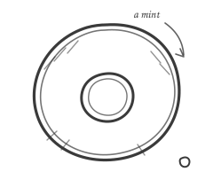

[](https://github.com/benemon/mint4v/actions/workflows/ci.yml)
[](https://github.com/benemon/mint4v/actions/workflows/e2e.yml)

# mint4v

> **Community Project** — not affiliated with, maintained, or supported by
> IBM or HashiCorp. Cloud Pak for Data and Vault are their products; mint4v
> just talks to them.



Token Minter for Vault. mint4v replaces the long-lived Vault token stored in
IBM Cloud Pak for Data's external-vault integration with a short-lived,
automatically rotated one. It runs as a single-replica Deployment: it logs in
to Vault with the Kubernetes ServiceAccount identity it runs as, pushes the
resulting service token to CP4D's vault-update API, renews the token in
place, rotates it at max TTL, and revokes it on shutdown. The token exists
only in process memory.

## Architectural boundaries

**A token broker, not an operator.** mint4v is one binary, one HCL config
file, one Deployment. There are no CRDs and no reconcile loop — the Helm
chart is the whole deployment surface. If the process dies, Kubernetes
restarts it and it mints and pushes a fresh token; that restart path is the
recovery mechanism, and nothing else is.

**CP4D is the integration; the machinery is generic.** The push side is a
templated HTTP request (Go `text/template`), so any API that stores a Vault
token can be a target, but CP4D is what the defaults, the documentation, and
the e2e suite are built around. The mock CP4D used in e2e implements the real
contract — `/icp4d-api/v1/authorize` and `PATCH /zen-data/v2/vaults/<urn>`,
including token validation against Vault when `validate_and_save=true`.

**Exactly one replica.** A second minter would push competing tokens and
revoke its peer's. The chart hardcodes `replicas: 1` with a
[`Recreate` strategy](https://kubernetes.io/docs/concepts/workloads/controllers/deployment/#recreate-deployment)
so the old pod revokes before the new one logs in. There is no HA mode and
none is planned: the failure window is bounded by pod restart time, during
which CP4D's existing token keeps working.

## How it works

```
 ServiceAccount JWT ──► Vault login ──► push token to CP4D
                            │                    ▲
                            ▼                    │ (only at rotation)
                     renew in place ── max TTL ──┘── revoke old after grace
```

The first login and push fail fast, so misconfiguration surfaces as a crash
loop. During rotation, failures are retried with backoff while the previous
token drains; the old token is never revoked until its replacement has been
pushed successfully. On SIGTERM the current token is revoked before exit. On
crash without revocation, the token dies at its TTL — `token_ttl` on the
Vault role is the bound on an orphaned token's lifetime, and
`token_max_ttl` sets the rotation cadence.

Batch tokens are refused at startup — renewal and revocation require
renewable
[service tokens](https://developer.hashicorp.com/vault/docs/concepts/tokens#service-tokens).

## Prerequisites

- Go 1.26+ (development only)
- Docker, kind, and Helm (e2e only); `oc` for the OpenShift in-cluster
  build scenario
- A Vault auth role (`kubernetes` or `jwt` method) bound to the minter's
  ServiceAccount
- A CP4D user with vault-administration permission

## Getting started

There are three supported build-and-deploy scenarios. In every one, the
values file is the only artifact you maintain — config, templates, CA
references, and credentials in one place; leave `image.*` unset in it, the
deployment step supplies the image reference. Each scenario is driven by
make or by the equivalent raw CLI commands.

**External build → Kubernetes or OpenShift.** Build and push to a registry
the cluster can pull from, then deploy. The two platforms differ only in
which kubeconfig you point at — the chart's pod spec satisfies the
restricted profile on both:

```sh
make docker-build docker-push IMG=<registry>/mint4v:<tag>
make deploy IMG=<registry>/mint4v:<tag> NAMESPACE=<namespace> VALUES=my-values.yaml
```

```sh
# equivalent CLI
docker build -t <registry>/mint4v:<tag> . && docker push <registry>/mint4v:<tag>
helm upgrade --install mint4v charts/mint4v -n <namespace> -f my-values.yaml \
    --set image.repository=<registry>/mint4v --set image.tag=<tag>
```

**In-cluster OpenShift build → OpenShift.** No external registry: a
[binary build](https://docs.redhat.com/en/documentation/openshift_container_platform/latest/html/builds_using_buildconfig/creating-build-inputs#builds-binary-source_creating-build-inputs)
lands the image in the internal registry, and the deploy references it. One
target composes build, deploy, and a restart (the internal tag is mutable,
so a restart is what picks up the new build):

```sh
make ocp-deploy NAMESPACE=<namespace> VALUES=my-values.yaml
```

```sh
# equivalent CLI
oc new-build --binary --strategy=docker --name=mint4v -n <namespace>   # once
oc start-build mint4v -n <namespace> --from-dir=. --follow
helm upgrade --install mint4v charts/mint4v -n <namespace> -f my-values.yaml \
    --set image.repository=image-registry.openshift-image-registry.svc:5000/<namespace>/mint4v \
    --set image.tag=latest --set image.pullPolicy=Always
oc rollout restart deployment/mint4v -n <namespace>
```

`make ocp-build` is the build half on its own. The fourth cell of
the matrix — in-cluster build, deployment elsewhere — is not supported: the
internal registry is not pullable from outside the cluster.

Two prerequisites no target can arrange for you: the namespace must exist
(or your credentials must be able to create it — namespace-scoped admin
cannot), and the Vault auth role must bind the *target* namespace's
identity (`bound_service_account_namespaces` /
`bound_subject: system:serviceaccount:<namespace>:mint4v`) — deploying the
same values into a different namespace fails at login until the role
follows.

The configuration is one HCL file, templates included. The chart mounts
everything it references at fixed paths: the config from a ConfigMap at
`/etc/minter/config.hcl`, optional CA-bundle Secrets at
`/etc/minter/tls/vault/` and `/etc/minter/tls/target/`, an optional
credentials Secret at `/etc/minter/credentials/`, and a
[projected ServiceAccount token](https://kubernetes.io/docs/concepts/storage/projected-volumes/#serviceaccounttoken)
at `/var/run/secrets/minter/token`. Each mounted item takes either the name
of an existing Secret (`vaultCASecret`, `targetCASecret`,
`credentialsSecret`) or an inline literal (`vaultCA`, `targetCA`,
`credentials`) that the chart materializes as a Secret itself — the two
forms are mutually exclusive per item, and inline credentials end up in the
values file and Helm release Secret, so prefer the existing-Secret form for
anything beyond a lab. The pod satisfies the
[restricted Pod Security Standard](https://kubernetes.io/docs/concepts/security/pod-security-standards/#restricted)
with the default SA token mount disabled — compatible with OpenShift's
`restricted-v2` SCC. See the comments in
[charts/mint4v/values.yaml](charts/mint4v/values.yaml) for the full values
reference.

## Configuration reference

One HCL file, passed as `-config /path/to/config.hcl`.

### Top level

| Field | Default | Description |
|-------|---------|-------------|
| `log_level` | `info` | `debug`, `info`, `warn`, or `error`. Logs never contain the token — accessors only |
| `health_address` | `:8080` | Listen address for `/healthz` (readiness) and `/livez` (liveness), used by the chart's probes |

### `vault`

| Field | Default | Description |
|-------|---------|-------------|
| `address` | | Vault address (required) |
| `namespace` | | [Vault Enterprise namespace](https://developer.hashicorp.com/vault/docs/enterprise/namespaces) |
| `ca_cert_file` | | PEM bundle that **replaces** the trust pool for the Vault connection (a true pin — only this CA validates Vault), mounted from a Secret (`vaultCASecret` in the chart) |
| — | | mTLS client certificates for Vault listeners that require them are not first-class config; the client honours `VAULT_CLIENT_CERT`/`VAULT_CLIENT_KEY` env vars, but this path is untested. All other `VAULT_*` environment variables are ignored: the config file is authoritative, so `VAULT_ADDR`, `VAULT_AGENT_ADDR`, `VAULT_TOKEN`, `VAULT_NAMESPACE`, `VAULT_SKIP_VERIFY`, and `VAULT_TLS_SERVER_NAME` cannot reroute or weaken the connection |
| `revoke_grace` | `30s` | How long the old token outlives its replacement after a rotation push |

### `vault.auth`

| Field | Default | Description |
|-------|---------|-------------|
| `method` | | [`kubernetes`](https://developer.hashicorp.com/vault/docs/auth/kubernetes) or [`jwt`](https://developer.hashicorp.com/vault/docs/auth/jwt) (required) |
| `role` | | Vault auth role (required) |
| `mount_path` | method name | Auth mount path |
| `token_file` | in-pod SA token path | ServiceAccount token file. The chart mounts a [projected token](https://kubernetes.io/docs/concepts/storage/projected-volumes/#serviceaccounttoken) at `/var/run/secrets/minter/token` |

### `push`

| Field | Default | Description |
|-------|---------|-------------|
| `url` | | Target URL (required). For CP4D: `https://<host>/zen-data/v2/vaults/<urn>?validate_and_save=true` |
| `method` | `POST` | HTTP method. CP4D vault updates use `PATCH` |
| `ca_cert_file` | | PEM bundle for the target connection, mounted from a Secret (`targetCASecret` in the chart). Deliberately a separate pool from the Vault CA |
| `body_template` | | Inline payload template, usually an [HCL heredoc](https://developer.hashicorp.com/terraform/language/expressions/strings#heredoc-strings) (required) |
| `credentials_file` | | JSON object mounted from a Secret, exposed to header templates as `{{ .Credentials.* }}`. Mutually exclusive with `push.login.credentials_file` (one file feeds both) |
| `headers` | | Request headers. Values are templates rendered once at startup with `{{ .Credentials.* }}`, so a secret-bearing header (e.g. a ZenApiKey) is sourced from the credentials Secret, never inlined in the ConfigMap-resident config |
| `extra` | | Static key/values exposed to the payload template as `{{ .Extra.* }}` |

### `push.login` (optional block)

CP4D always authenticates — this block is one of the two ways to satisfy
it. Include it for the Bearer session exchange against
`/icp4d-api/v1/authorize`; omit it and template the ZenApiKey into
`push.headers` from `push.credentials_file` (e.g.
`Authorization = "ZenApiKey {{ .Credentials.zen_api_key }}"`) instead. See
[Cloud Pak for Data integration](#cloud-pak-for-data-integration) for the
trade-off. (Only a non-CP4D target with genuinely unauthenticated writes
would omit both.)

| Field | Default | Description |
|-------|---------|-------------|
| `url` | | Login endpoint. For CP4D: `https://<host>/icp4d-api/v1/authorize` |
| `body_template` | | Inline login body template, rendered with `{{ .Credentials.* }}` |
| `token_field` | | Dot-path to the bearer token in the JSON response (`token` for CP4D) |
| `credentials_file` | | JSON object mounted from a Secret, exposed as `{{ .Credentials.* }}` |

### Templating

Two inline Go [`text/template`](https://pkg.go.dev/text/template) strings
drive everything mint4v sends. `push.body_template` renders the payload for
every push — the initial one and each rotation. `push.login.body_template`,
when the `login` block is present, renders the pre-login body immediately
before each push. Both are parsed once at startup, so a syntax error fails
the process before it ever touches Vault; rendering happens per request.

#### Variables

Payload template:

| Variable | Type | Value |
|----------|------|-------|
| `{{ .VaultToken }}` | string | the minted Vault service token — the secret being delivered |
| `{{ .Accessor }}` | string | the token's accessor: safe to log or store, usable by a Vault administrator for lookup and revocation but never for authentication |
| `{{ .TTLSeconds }}` | int | the token's TTL at mint time — a number, so leave it unquoted in JSON |
| `{{ .Extra.<key> }}` | string | static values from `push.extra`, for anything the target wants alongside the token (the vault address, an integration id) |

Login template:

| Variable | Type | Value |
|----------|------|-------|
| `{{ .Credentials.<key> }}` | string | keys of the flat JSON object read from `credentials_file` at startup |

The data model is deliberately this small: one custom function (`toJSON`,
which emits a value as a JSON literal — see [Escaping](#escaping)), no
Sprig, no file access, no way to reach anything not listed. A template
controls the shape of one HTTP body, nothing more — if the target needs
another value, add it to `push.extra`; if it needs computation, do it
before it reaches the config.

#### Failure semantics

Templates run with
[`missingkey=error`](https://pkg.go.dev/text/template#Template.Option): a
reference to anything that does not exist — a typo, an `extra` key that was
never defined, a credential key absent from the file — fails the render,
and the push with it. A failed initial push is a crash loop, so
misconfiguration is loud rather than silently pushing a payload with an
empty token field. Execution errors are reduced to the error string before
logging, so the data being rendered — the token — cannot leak into logs;
a unit test pins this.

#### Escaping

Two layers wrap a template, each with exactly one rule:

- **HCL heredocs.** `<<-EOT` strips leading indentation to the
  least-indented line. HCL's own interpolation sequences are `${` and
  `%{` — a literal `${` in a payload must be written `$${`, a literal
  `%{` as `%%{`. Go's `{{ }}` means nothing to HCL and passes through
  untouched, so the two template languages cannot collide.
- **JSON.** Rendered values are substituted verbatim, not JSON-escaped.
  Vault tokens and accessors are JSON-safe by construction (alphanumerics
  and dots), so `"{{ .VaultToken }}"` inside quotes is always correct. For
  `Extra` or `Credentials` values that might contain quotes or
  backslashes, render with the `toJSON` template function, which emits the
  value as a JSON literal, quotes included:

  ```
  {"note":{{ toJSON .Extra.note }},"access_token":"{{ .VaultToken }}"}
  ```

  (Do not reach for `printf "%q"` — that is Go quoting, not JSON, and the
  two diverge on some control and non-ASCII characters.)

The [examples](examples/) directory carries complete rendered-in-anger
profiles; the CP4D payload is dissected under
[Cloud Pak for Data integration](#cloud-pak-for-data-integration).

Secrets, CA bundles, and the ServiceAccount token deliberately stay file
references rather than inlining: the config lives in a ConfigMap, so
inlining a credential would move it out of Secret custody, and certificates
arrive in Kubernetes as mounted files.

## Cloud Pak for Data integration

Built against the CP4D 5.x Platform API documentation and exercised
end-to-end against a mock that implements the documented contract
(including token validation on `validate_and_save=true`). Validation
against a live CP4D instance is still outstanding — the payload template
and URN are config-only changes if the real thing diverges. A
`hashicorp_token` vault integration is updated with:

```
PATCH https://<cpd-host>/zen-data/v2/vaults/<vault_urn>?validate_and_save=true
Authorization: ZenApiKey <base64(username:apikey)>   (or: Bearer <session token>)
Content-Type: application/json

{"details": {"vault_address": "<vault-address>", "access_token": "<vault-token>"}}
```

`vault_urn` is `<creator uid>:<vault_name>`. With `validate_and_save=true`,
CP4D tests the pushed token against Vault before saving it, so every
rotation is verified end to end. The matching config:

```hcl
push {
  url     = "https://cpd.example.com/zen-data/v2/vaults/1000330999:my-vault?validate_and_save=true"
  method  = "PATCH"
  headers = { "Content-Type" = "application/json" }
  extra   = { vault_address = "https://vault.example.com:8200" }

  body_template = <<-EOT
    {"details":{"vault_address":"{{ .Extra.vault_address }}","access_token":"{{ .VaultToken }}"}}
  EOT
}
```

CP4D accepts two authentication styles, both supported:

- **ZenApiKey** (static): omit the `login` block; store
  `{"zen_api_key": "<base64 of username:apikey>"}` in the credentials Secret,
  point `push.credentials_file` at it, and set
  `Authorization = "ZenApiKey {{ .Credentials.zen_api_key }}"` in
  `push.headers`. The key stays in Secret custody — never put the literal
  value in `push.headers`, which lands in a ConfigMap.
- **Bearer session token**: point the `login` block at
  `/icp4d-api/v1/authorize` with `token_field = "token"`. The exchange runs
  before each push; pushes happen once per rotation, so session-token expiry
  is irrelevant.

### Sourcing the CP4D credential

The CP4D credential is the one long-lived secret left in the design. Store
it in Vault and sync it with the
[Vault Secrets Operator](https://developer.hashicorp.com/vault/docs/platform/k8s/vso):
a [`VaultStaticSecret`](https://developer.hashicorp.com/vault/docs/platform/k8s/vso/api-reference#vaultstaticsecret)
renders the KV entry into a Kubernetes Secret with a `credentials.json`
key, and `credentialsSecret` in the chart values points at it. There is no circular dependency — this credential authenticates
mint4v *to CP4D*; the token CP4D uses *for Vault* is the one mint4v mints.
The credential is read at startup, so a rotated Secret takes effect on the
next pod restart.

## Vault setup

### Version compatibility

| Tier | Versions | Evidence |
|------|----------|----------|
| Tested | Vault OSS 1.18 | full KIND e2e suite in CI |
| Tested | Vault Enterprise 2.0.x | namespace lifecycle spec in CI (`vault-enterprise:2.0-ent`); full external suite against a live Enterprise 2.0.3 cluster |
| Expected to work | any Vault serving the `kubernetes`/`jwt` auth APIs | the client surface is two login fields plus token renew/revoke, stable across supported Vault versions |

The auth role must issue renewable
[service tokens](https://developer.hashicorp.com/vault/docs/concepts/tokens#service-tokens);
`token_ttl` and `token_max_ttl` semantics are documented under
[token TTLs](https://developer.hashicorp.com/vault/docs/concepts/tokens#token-time-to-live-periodic-tokens-and-explicit-max-ttls).
Suggested starting point — 15m TTL, 24h rotation:

```sh
vault write auth/kubernetes/role/cp4d \
    bound_service_account_names=mint4v \
    bound_service_account_namespaces=<namespace> \
    audience=vault \
    token_policies=cp4d-read \
    token_ttl=15m token_max_ttl=24h
```

The policy attached to this role is the blast radius of the whole system —
scope it to exactly the paths CP4D reads.

Do not use
[periodic tokens](https://developer.hashicorp.com/vault/docs/concepts/tokens#periodic-tokens)
(`token_period` on the role): they renew indefinitely and never reach a max
TTL, so rotation never fires and the token becomes effectively permanent.
`token_ttl` + `token_max_ttl` is the intended shape.

For the [`jwt` method](https://developer.hashicorp.com/vault/docs/auth/jwt),
Vault validates the SA token against the cluster's OIDC issuer instead of
calling TokenReview — use it when Vault cannot reach the API server. One
caveat worth stating here because it is easy to trip on:
`oidc_discovery_url` must exactly match the cluster's issuer (e.g.
`https://kubernetes.default.svc.cluster.local`, not `…svc`).

### Who needs `system:auth-delegator`

The [`kubernetes` auth method](https://developer.hashicorp.com/vault/docs/auth/kubernetes)
validates tokens via the
[TokenReview API](https://kubernetes.io/docs/reference/kubernetes-api/authentication-resources/token-review-v1/),
and the identity making that call needs the
[`system:auth-delegator`](https://kubernetes.io/docs/reference/access-authn-authz/rbac/#other-component-roles)
ClusterRole. Which identity that is depends on the mount configuration
(see [`disable_local_ca_jwt`](https://developer.hashicorp.com/vault/api-docs/auth/kubernetes#disable_local_ca_jwt)):

| Mount configuration | TokenReview caller | Grant `auth-delegator` to | Client credential |
|---------------------|--------------------|---------------------------|-------------------|
| `token_reviewer_jwt` configured | that JWT's identity | the reviewer's ServiceAccount | projected token, `audience=vault` (chart default) |
| No reviewer JWT; Vault in-cluster | Vault's own pod ServiceAccount | Vault's pod ServiceAccount | any, including a [legacy Secret token](https://kubernetes.io/docs/concepts/configuration/secret/#service-account-token-secrets) (`tokenSecretName` in the chart) |
| No reviewer JWT; Vault external (or `disable_local_ca_jwt=true`) | the client's login JWT | **mint4v's** ServiceAccount | must be API-server-valid: set `tokenAudience: ""` in the chart |
| `jwt` auth method | nobody (JWKS signature check) | nobody | projected token, audience per the role |

The caveat in the third row is load-bearing: a `vault`-audience JWT cannot
authenticate to the API server to perform its own TokenReview. All four
rows are exercised by the e2e suite.

## Development and testing

```sh
make test        # unit tests (fake Vault + httptest targets)
make lint        # golangci-lint
make helm-lint   # chart lint
make docker-build IMG=mint4v:dev
make test-e2e    # KIND + real Vault + mock CP4D
```

The make targets are thin wrappers over the standard tools; without make:

```sh
go build -o bin/mint4v ./cmd
go test $(go list ./... | grep -v /e2e) -coverprofile cover.out
helm lint charts/mint4v
docker build -t mint4v:dev .
```

The one exception is the KIND e2e suite, which invokes `make docker-build`
itself to build the images it loads — running it requires make. The
external-cluster variant below is make-free.

The e2e suite creates a kind cluster, deploys a dev-mode Vault and the mock
CP4D API ([test/mockcpd](test/mockcpd/)), installs the chart, and asserts
with deliberately short TTLs (1m/2m): the token is pushed and valid, renewed
in place past its initial TTL without a re-push, rotated at max TTL with the
old token revoked after the grace period, recovered after an out-of-band
revocation, and revoked when the Deployment is scaled down — across all
three kubernetes-auth TokenReview models and the jwt method. With
`VAULT_LICENSE` set, the dev Vault runs Vault Enterprise
(`hashicorp/vault-enterprise:2.0-ent`) and a further spec proves the full
lifecycle inside a Vault namespace; without a license that spec skips.

The same suite can target an existing cluster (e.g. OpenShift) and an
external Vault instead of provisioning KIND:

```sh
make ocp-build-e2e              # in-cluster binary builds via the internal registry
make test-e2e-external \
    E2E_VAULT_ADDR=https://vault.example.com:8200 \
    E2E_VAULT_TOKEN=... \
    E2E_VAULT_NAMESPACE=infra/claude \
    E2E_KUBERNETES_HOST=https://api.cluster.example.com:6443
```

```sh
# equivalent CLI (the env contract is the whole interface)
E2E_EXTERNAL=true \
E2E_VAULT_ADDR=https://vault.example.com:8200 \
E2E_VAULT_TOKEN=... \
E2E_VAULT_NAMESPACE=infra/claude \
E2E_KUBERNETES_HOST=https://api.cluster.example.com:6443 \
E2E_IMG=image-registry.openshift-image-registry.svc:5000/mint4v-e2e/mint4v:latest \
E2E_MOCK_IMG=image-registry.openshift-image-registry.svc:5000/mint4v-e2e/mockcpd:latest \
go test ./test/e2e/ -v -ginkgo.v -timeout=30m
```

Optional: `VAULT_CACERT` (also delivered to the minter as its Vault CA),
`E2E_KUBERNETES_CA_FILE` (defaults to the kubeconfig's CA),
`E2E_NAMESPACE`, `E2E_IMG`/`E2E_MOCK_IMG`, and `E2E_KEEP=true` to leave the
deployment running afterwards. In external mode, Vault mounts are prefixed
`mint4v-e2e-` and removed on cleanup; the self-review spec skips (it needs
an in-cluster Vault), and jwt auth is configured from the cluster's JWKS via
`jwt_validation_pubkeys` since the issuer is unreachable from an external
Vault.

CI: [ci.yml](.github/workflows/ci.yml) runs lint, unit tests, and chart
checks on pushes to main and PRs; [e2e.yml](.github/workflows/e2e.yml) runs
the full KIND suite on PRs. Both support `workflow_dispatch` and publish
JUnit reports as check runs (`JUNIT_REPORT=<file>` does the same locally).
Dependabot watches Go modules and Actions weekly.

Releases are tag-triggered (`v*`): [release.yml](.github/workflows/release.yml)
re-runs the unit and e2e suites as gates, then publishes the mint4v
binaries (linux/amd64, linux/arm64, darwin/arm64) and the packaged Helm
chart versioned from the tag. Deliberately no container image is built or
published — build your own with `make docker-build` (or `make ocp-build`)
so image provenance stays in your hands.

## Threat model

See [docs/threat-model.md](docs/threat-model.md) — structured after the
Vault Secrets Operator threat model, covering the minted token's custody,
the credentials mint4v consumes, and recommendations for secure deployment.
