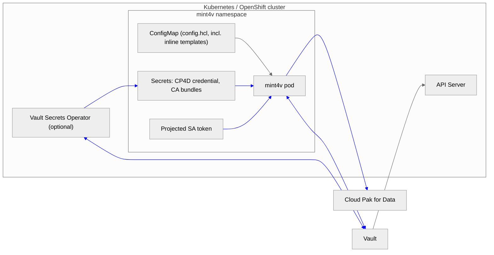

# mint4v Threat Model

mint4v exchanges a Kubernetes ServiceAccount identity for a short-lived Vault
token and delivers that token to IBM Cloud Pak for Data's vault integration
API, replacing the long-lived static token CP4D would otherwise hold. This
threat model highlights how running mint4v affects your security posture and
provides recommendations for running it securely. Its structure follows the
[Vault Secrets Operator threat model](https://github.com/hashicorp/vault-secrets-operator/blob/main/docs/threat-model/README.md).

## Executive summary and recommendations for secure use

mint4v's purpose is to *shrink* an existing exposure: without it, CP4D holds a
long-lived Vault token that survives compromise indefinitely; with it, the
token CP4D holds expires within `token_ttl` of any failure and is rotated at
`token_max_ttl`. The process itself, however, continuously holds a live Vault
token and a CP4D credential, so it must be deployed carefully:

* Deploy mint4v in its own namespace with RBAC limited to a small set of
  operators. Anyone who can read the namespace's Secrets or exec into the pod
  can obtain the CP4D credential; anyone who can read pod memory can obtain
  the live Vault token.
* Scope the Vault auth role's policy to exactly the paths CP4D needs to read.
  The policy attached to the minted token is the blast radius of the entire
  system.
* Keep `token_ttl` short (minutes to tens of minutes) — it bounds how long an
  orphaned token lives if mint4v dies without revoking. `token_max_ttl` sets
  rotation cadence.
* Prefer the audience-bound projected ServiceAccount token (the chart
  default) over long-lived legacy Secret tokens; prefer the reviewer-JWT
  TokenReview model over granting `system:auth-delegator` to workload SAs.
* Use TLS with custom CA bundles for both Vault and CP4D (the Vault CA is a
  true pin — it replaces the trust pool — while the CP4D CA is added to the
  system roots; see threat 2). The Vault token transits the CP4D connection
  in the request body on every push.
* Source the CP4D credential from Vault via the Vault Secrets Operator (see
  below) rather than hand-managed Secrets, and scope that CP4D user to vault
  administration only.
* Enable Vault audit logging; every mint, renewal, and revocation is
  attributable to mint4v's ServiceAccount, and pushes to CP4D with
  `validate_and_save=true` appear as token lookups.
* Encrypt etcd at rest with a KMS provider — the CP4D credential Secret (and
  the legacy SA token Secret, if used) live there.
* Run exactly one replica (the chart enforces this) and keep the pod spec the
  chart ships: non-root, read-only rootfs, no privilege escalation, default
  SA token mount disabled.
* Consider a NetworkPolicy: mint4v needs egress to Vault and CP4D only, and
  nothing needs ingress to it beyond the kubelet's probes. The chart does
  not ship one because policy shape is cluster-specific.
* Supply chain: no container images are published — you build from source
  (`make docker-build` / `make ocp-build`), so image provenance is yours.
  Released binaries carry SHA-256 checksums but are not signed and have no
  SBOM; environments that require either should build from the tagged
  source.

## Terminology

* **mint4v**: this process, running as a single-replica Deployment.
* **Vault**: the HashiCorp Vault server mint4v mints tokens from.
* **CP4D**: IBM Cloud Pak for Data (or IBM Software Hub), the target that
  receives and stores the minted token in its vault integration.
* **Minted token**: the short-lived Vault service token mint4v obtains,
  renews, rotates, and revokes.
* **SA token**: the Kubernetes ServiceAccount credential mint4v logs in to
  Vault with — a projected (ephemeral, optionally audience-bound) token or a
  legacy Secret-based token.
* **CP4D credential**: the username/api_key (or ZenApiKey) mint4v uses to
  authenticate to CP4D's API.

## Scope and limitations

### Scope

* The lifecycle of the minted token: acquisition, in-memory custody, renewal,
  delivery to CP4D, rotation, and revocation.
* The credentials mint4v itself consumes: the SA token and the CP4D
  credential.

### Limitations

* Securing and configuring Vault is covered by
  [Vault's threat model](https://developer.hashicorp.com/vault/docs/internals/security).
* CP4D's internal handling of the token after a successful push (storage,
  encryption, access control within CP4D) is IBM's concern and out of scope;
  mint4v's mitigation for CP4D-side compromise is the token's short TTL and
  narrow policy, not prevention of disclosure.
* Kubernetes/OpenShift platform hardening is out of scope; see the
  [Kubernetes security documentation](https://kubernetes.io/docs/concepts/security/).
* Secondary effects after secret disclosure are not considered.

## Detailed description

### Data flow diagram

Links in blue carry secret material.

* mint4v sends its SA token to Vault and receives the minted token
  (login/renew/revoke traffic).
* mint4v sends the CP4D credential to CP4D's authorize endpoint and the
  minted token to the vault-update endpoint (`PATCH /zen-data/v2/vaults/...`).
* Vault calls the API Server's TokenReview endpoint to validate logins
  (kubernetes auth; identity used depends on the TokenReview trust model —
  see the README).
* Optionally, the Vault Secrets Operator syncs the CP4D credential from Vault
  into the Secret mint4v mounts.

### Design properties relevant to this model

* The minted token exists only in process memory; it is never written to disk
  and never logged (logs carry the token accessor only). Template execution
  errors are reduced to the error string, and HTTP error response bodies are
  never logged at all — only their status, content type, and length — since a
  target error can echo the submitted payload.
* Batch tokens are refused at login; only renewable service tokens (which can
  be revoked) are accepted.
* On SIGTERM the token is revoked before exit; on crash, the token dies at
  `token_ttl`. On rotation, the old token is revoked after a short grace
  period. Failed pushes never leave the old token revoked prematurely.
* CP4D's `validate_and_save=true` causes CP4D to verify each pushed token
  against Vault before accepting it, making a rogue or broken push visible.
* HTTP redirects from the target are refused: following one would convert the
  push into a bodyless GET whose success response masks a failed delivery, or
  replay the token body to another host.
* The `/healthz` (readiness) and `/livez` (liveness) endpoints are
  unauthenticated by design (the kubelet probes them); they expose only a
  coarse status string, never token material. Liveness deliberately ignores
  delivery state so a target outage cannot trigger a restart that revokes a
  still-valid token.

## Threats

The following assets were enumerated while considering attacks affecting the
confidentiality and integrity of the minted token and the credentials around
it:

1. The minted token in mint4v's memory.
2. The minted token in transit to CP4D, and at rest inside CP4D.
3. The SA token (projected file or legacy Secret) that can mint further tokens.
4. The CP4D credential Secret.
5. Vault auth role and policy configuration.
6. TokenReview trust grants (`system:auth-delegator` bindings).

### Threats specific to mint4v

| ID | Threat | Categories | Description | Mitigation |
|----|--------|------------|-------------|------------|
| 1 | An attacker snoops on or tampers with traffic between mint4v and Vault | Information disclosure, tampering, spoofing | Login requests carry the SA token; responses carry the minted token. The route may cross namespaces or leave the cluster. | TLS with a pinned CA (`vault.ca_cert`), optionally mutual TLS for listeners that require it (`vault.client_cert`/`client_key`); never expose Vault over plaintext outside dev. |
| 2 | An attacker snoops on traffic between mint4v and CP4D | Information disclosure, spoofing | Every push carries the minted token in the request body, and the pre-login carries the CP4D credential. CP4D may sit outside the cluster. | TLS with a custom CA (`target.ca_cert`). Note the asymmetry with Vault: the Vault CA **replaces** the trust pool (a true pin), while the target CA is **added to** the system roots — a certificate from any publicly-trusted CA still validates the CP4D route. The separate pools prevent a compromised Vault CA from validating the CP4D route or vice versa. |
| 3 | Compromise of the mint4v pod | Elevation of privilege, information disclosure | An attacker in the pod can read the minted token from memory, use the SA token to mint more tokens, and read the CP4D credential. | Restricted pod profile (non-root, read-only rootfs, no shell in ubi-micro, `restricted-v2` compatible); narrow Vault policy bounds what any minted token can do; short TTLs bound duration; audience-bound short-expiry projected tokens limit SA token reuse; Vault audit log attributes all mints to this SA. |
| 4 | Token leak via logs or error messages | Information disclosure | Failure paths (template errors, HTTP errors) can embed the data being processed — a target error body may even echo the submitted payload. | mint4v never logs the token: accessor-only logging, template errors are reduced to the error string, error response bodies are withheld entirely (only status, content type, and length are reported). Covered by unit tests `TestPushErrorNeverContainsToken` and `TestLoginErrorNeverContainsCredentials`, which assert against reflective error bodies. |
| 5 | Orphaned live token after a crash | Information disclosure | If mint4v dies without revoking (SIGKILL, node loss), the current token stays valid until its TTL. | Keep `token_ttl` short; a crashed or wedged process fails `/livez` and is restarted, minting fresh and re-pushing; monitor Vault audit logs for tokens that stop renewing. |
| 6 | A second mint4v instance races pushes and revocations | Denial of service, tampering | Two replicas would push competing tokens and revoke each other's, breaking CP4D's integration intermittently. | The chart hardcodes one replica with a `Recreate` strategy; CP4D credentials control who else can update the vault connection. |
| 7 | Rogue push to CP4D (attacker replaces the stored token) | Tampering, spoofing | Anyone holding a CP4D credential with vault-admin rights can overwrite the integration token. | Scope the CP4D user to vault administration only; `validate_and_save=true` forces the pushed token to be live in Vault, so a fabricated token is rejected; CP4D audit shows the update. |
| 8 | Overly permissive Vault role or policy | Elevation of privilege | The minted token's policy is what CP4D — and any thief of the token — can do in Vault. | Least-privilege policy per integration; bind the role to exactly mint4v's SA name/namespace; use a dedicated role per CP4D instance. |

### Threats specific to Kubernetes and the credential material

| ID | Threat | Categories | Description | Mitigation |
|----|--------|------------|-------------|------------|
| 9 | API access to the mint4v namespace | Information disclosure | Reading the CP4D credential Secret (or legacy SA token Secret), or exec'ing into the pod, yields live credentials. | Dedicated namespace; tight RBAC on Secrets, `pods/exec`, and `serviceaccounts/token`; audit API access. |
| 10 | Secrets at rest in etcd | Information disclosure | The CP4D credential Secret and any legacy SA token Secret are stored in etcd, unencrypted by default. | Encrypt etcd with a KMS provider; prefer projected tokens (never stored in etcd) over legacy token Secrets. |
| 11 | Stolen SA token replayed to mint tokens | Spoofing, elevation of privilege | The SA token is a bearer credential for the Vault role. | Projected tokens are audience-bound (`audience=vault`) so they are useless against the API server, short-lived, and rotated by the kubelet. The projection is tmpfs-backed: the token is never written to node disk or stored in etcd — only the legacy Secret token mode puts an SA credential at rest. The Vault role binds SA name + namespace; avoid the legacy mode unless required. |
| 12 | Abuse of `system:auth-delegator` grants | Elevation of privilege | The client-JWT review model grants mint4v's SA auth-delegator, letting any holder of its token perform arbitrary TokenReviews. | Prefer the reviewer-JWT model (delegator on a dedicated reviewer SA) or Vault self-review; if client-JWT review is required (external Vault), treat the mint4v SA's tokens as sensitive and keep their expiry short. |
| 13 | Tampering with mint4v's config (including the inline payload template) | Tampering | Whoever edits the ConfigMap controls where tokens are pushed and what the payload contains. | RBAC on ConfigMaps in the namespace; the Deployment's config checksum annotation makes changes visible as rollouts; review chart values in source control. |

## Sourcing the CP4D credential with the Vault Secrets Operator

The CP4D credential is the one long-lived secret left in this design. Rather
than hand-managing it, use the
[Vault Secrets Operator](https://developer.hashicorp.com/vault/docs/platform/k8s/vso)
to sync it from Vault into the Secret the chart mounts
(`credentialsSecret`):

* Store `{"username": "...", "api_key": "..."}` as a KV secret in Vault.
* A `VaultStaticSecret` in the mint4v namespace renders it to a Kubernetes
  Secret with a `credentials.json` key; VSO's own kubernetes-auth role should
  be distinct from mint4v's and readable only for that one KV path.
* Rotating the CP4D api_key becomes a Vault write; VSO propagates it and
  mint4v picks it up on its next pod restart (the credential is read at
  startup).

There is no circular dependency: this credential authenticates mint4v *to
CP4D*; the token CP4D uses *for Vault* is the one mint4v mints. VSO and
mint4v are complementary — VSO moves secrets from Vault into Kubernetes,
mint4v moves ephemeral Vault access into a system (CP4D) that cannot
authenticate to Vault natively.
